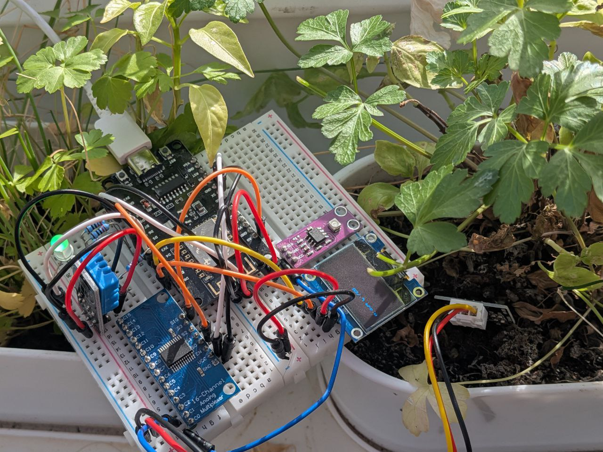
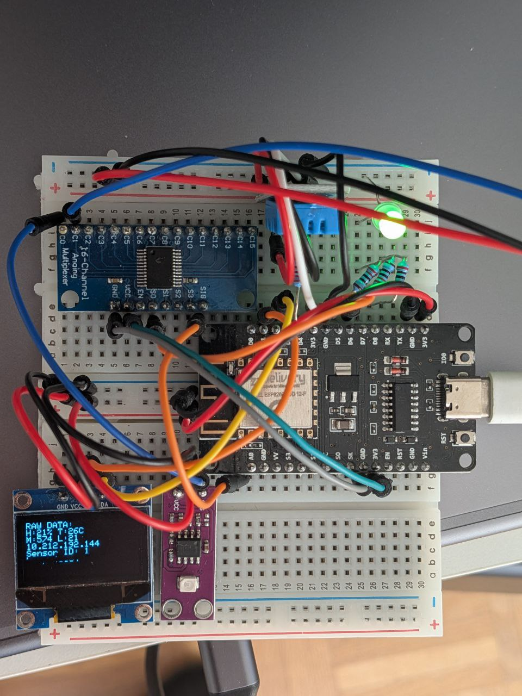
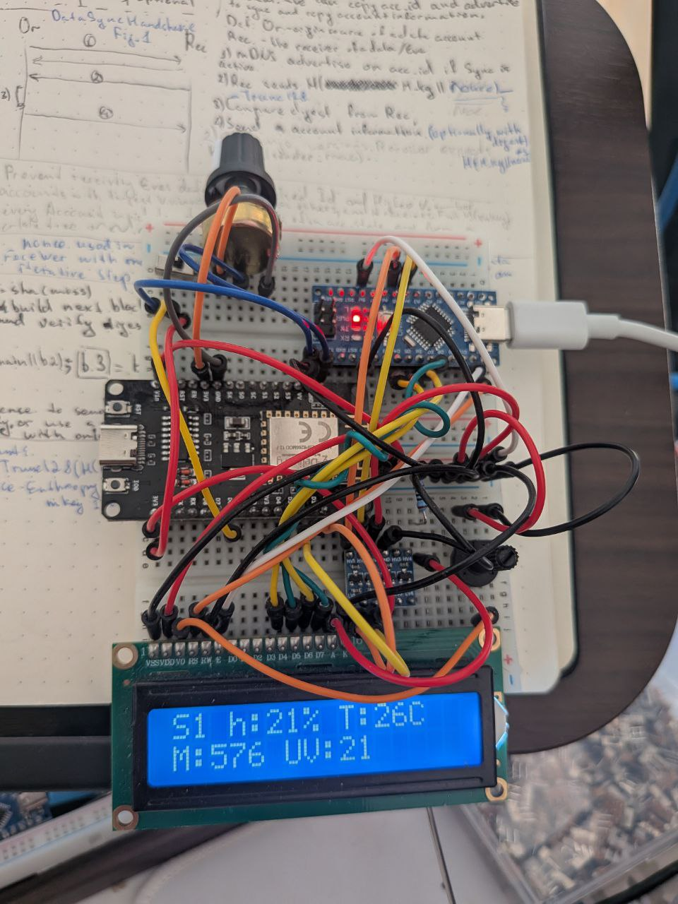

# Plant Care
PlantCare is a home IoT system designed to help people with Alzheimer's and other cognitive conditions maintain their plants through ambient lighting and configurable reminder triggers. The system keeps track of various sensors parameters and creates and ambient contextual lightning around plants, orange - plant needs more sun, blue - plant need more water, green - plant is fine. 

The current state is a working prototype that demonstrates the core architecture and key integration patterns, including communication between ESP nodes and Home Assistant OS.

Notable design note: The master node lacks a native I2C display, so an Arduino Nano was repurposed to act as an I2C bridge — a practical hardware workaround documented here for reference.

# Architecture overview

```
                      +------------------------+
Node Sensor - push -> | HA (home assistant) OS | 
                      +------------------------+
Collects                     ^                                 
data from                    |                                
sensors                   subscribes                        
                             |        
                        Master Node - serving as dashboard of collected data
```

Home assistant integration allows for automations, notifications and intergrations with other systems and hardware. 

# Setup

On first boot each node opens a captive portal (PlantCare-Master or PlantCare-Sensor) at 192.168.4.1. Connect to it and enter the WiFi credentials, HA IP, and for sensor nodes the master IP. Config is saved to LittleFS and the portal does not reappear after reboot.

# Build
Requires arduino-cli. The Makefile handles core/library installation automatically on first run.
```
  make master                  # compile master firmware
  make sensor-1                # compile sensor firmware, node ID = 1
  make sensor-2 HA_IP=192.168.1.10 MASTER_IP=192.168.1.20

  make upload-master PORT=/dev/ttyUSB0
  make upload-sensor-1 PORT=/dev/ttyUSB0

  make compiledb-master        # generate compile_commands.json (for LSP)
  make freeze-libs             # update libs.txt from currently installed libs
```
IPs can be baked in at compile time via HA_IP= and MASTER_IP=, or left as NULL to rely on the captive portal config.

# MQTT

Sensor nodes publish to `plants/sensor/<id>/state` every 2 seconds as `{"h":…,"t":…,"id":…,"m":…,"uv":…}` and send retained Home Assistant discovery payloads to homeassistant/sensor/plants_sensor<id>_{h,t,m,uv}/config on first connect. Availability is tracked on `plants/sensor/<id>/availability`. If MQTT is unreachable, sensor nodes fall back to HTTP POST to the master at /data.

The master subscribes to `plants/sensor/+/state` and expires sensors silent for more than 30 seconds.

# Components overview
[Node Sensor](https://app.cirkitdesigner.com/project/ae44ae01-049e-4d11-9962-7d177c8b3517):
+ 1 CJMCU GUVA S12SD Ultraviolet Sensor.
+ 1 SW390 Soil Moisture V2 Sensor.
+ 1 CD74HC4067 analog mux/dmux.
+ 1 ESP8266 nodemcuv2.
+ 1 RGB LED.
+ 1 OLED via I2C.
+ 1 DHT11.
+ 3 220 Ohm resistors




[Master Node](https://app.cirkitdesigner.com/project/af9f84e4-3372-4d50-b3e4-fac91a83b9a2):
Has two controlls, the switch and potentiometer. Switch is intended to switch between displaying sensors data and current IP. Potentiometer is used to select across dynamically derived discovered sensors from mqtt broker or via direct HTTP fallback.
+ 1 voltage shifter.
+ 1 Arduino Nano.
+ 1 LCD display. [Setup](https://docs.arduino.cc/learn/electronics/lcd-displays/)
+ 2 10k Ohm potentiometer.
+ 1 220 Ohm resistor
+ 1 ESP8266 nodemcuv2.
+ 1 Switch.

